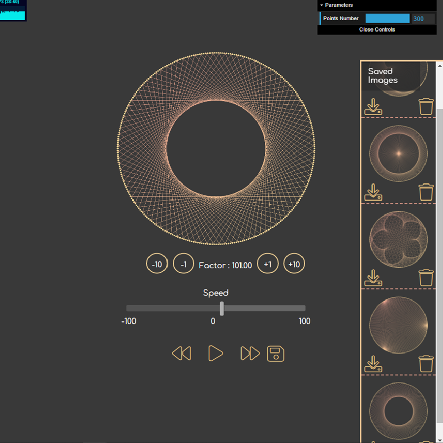
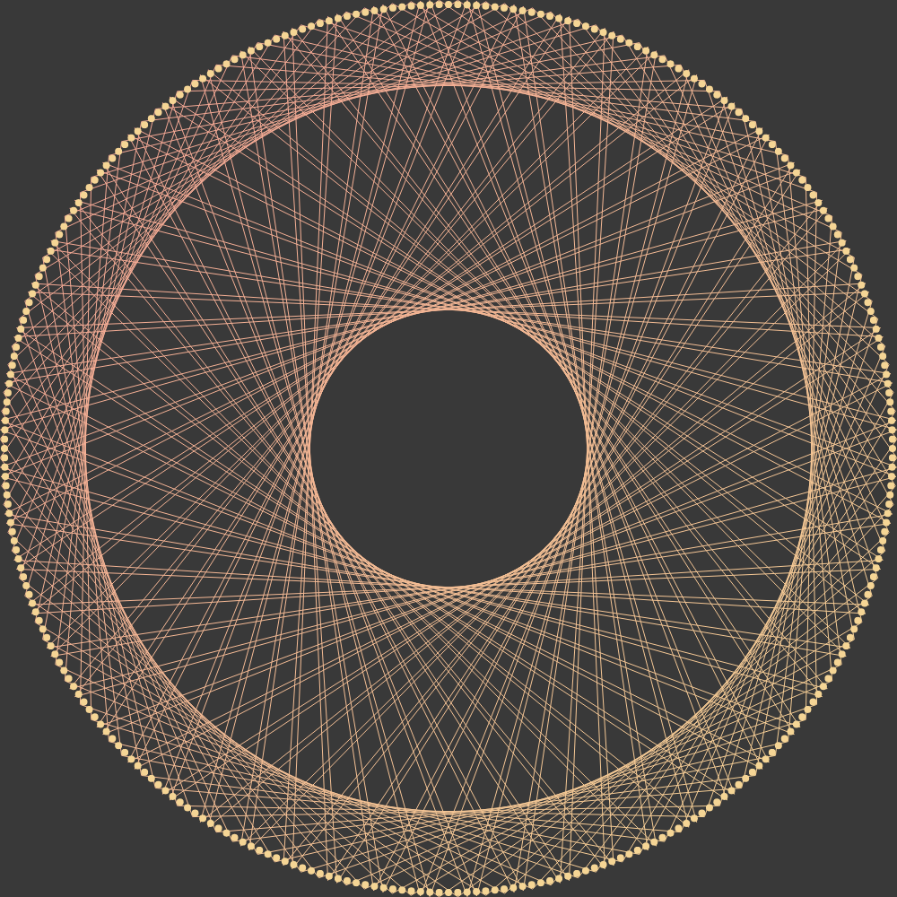
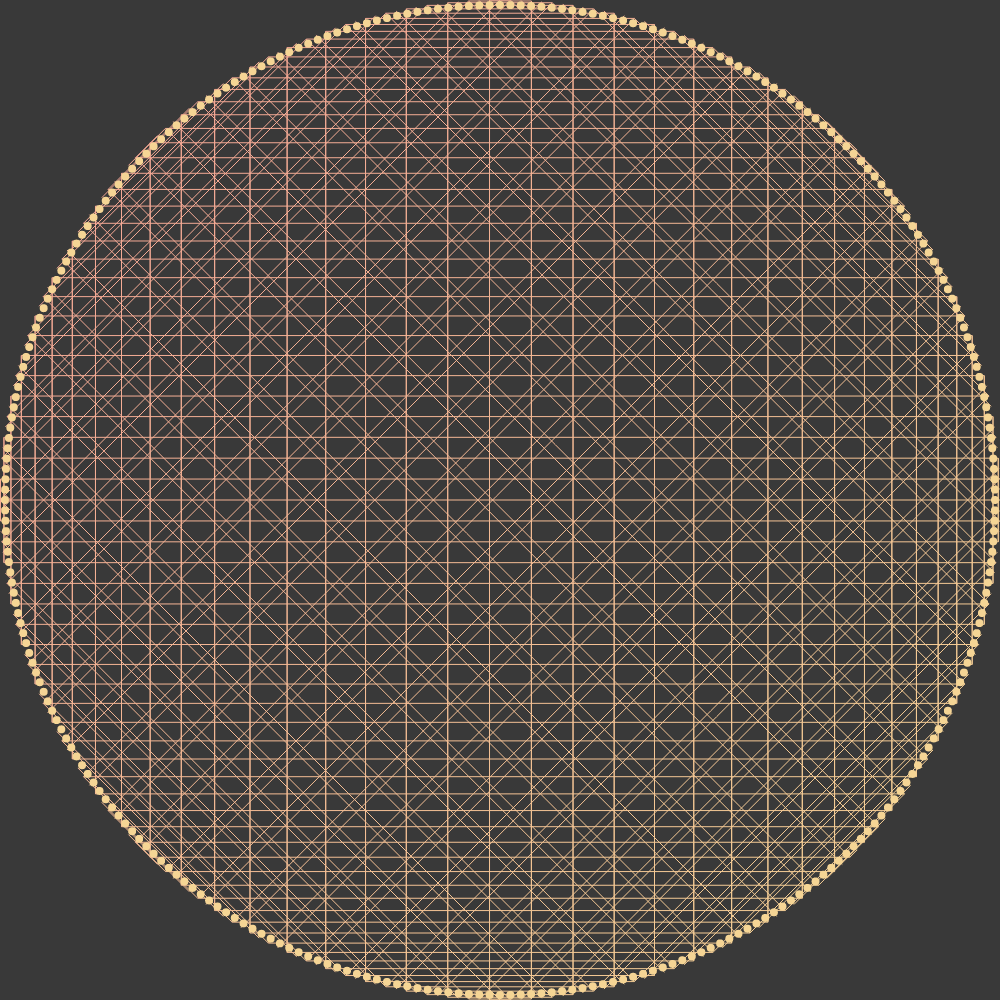
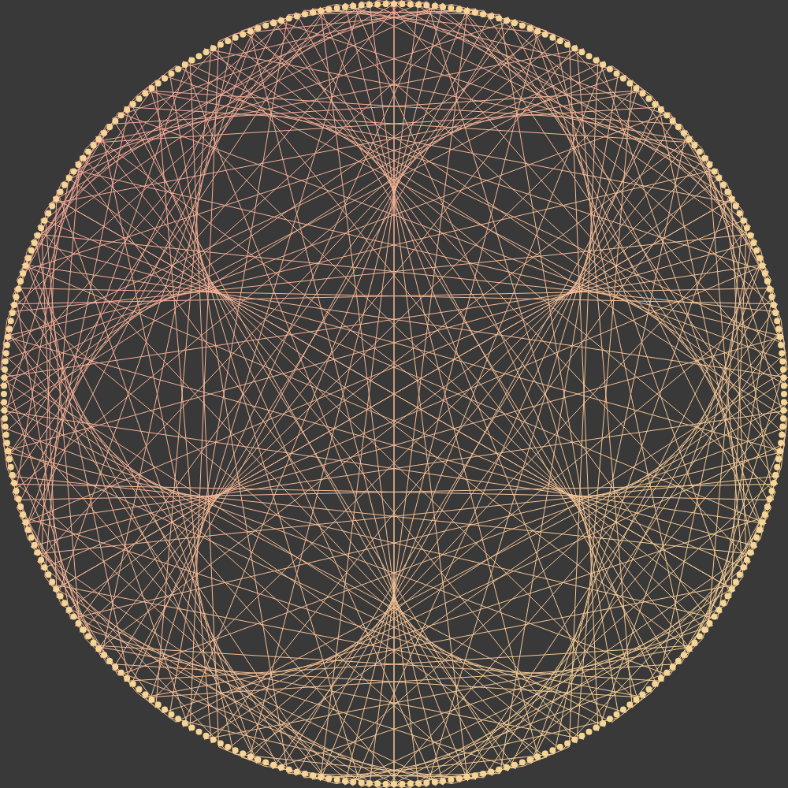

# Cardioid Modular Multiplication Table

A circular representation of the multiplication table.

Interface            
:-------------------------:
    

## Build With

Any additional information goes here

- JavaScript
    - JQuery
    - DatGui
    - StatsJS
- Html
- CSS

## Screenshots

Example #1                 |  Example #2               | Example #3
:-------------------------:|:-------------------------:|:-------------------------:
   |  |  
Factor : 61 | Factor : 74 | Factor : 103

## Demo

Demonstration gifs
Gif #1                     |  Gif #2     
:-------------------------:|:-------------------------:
       |  

 

